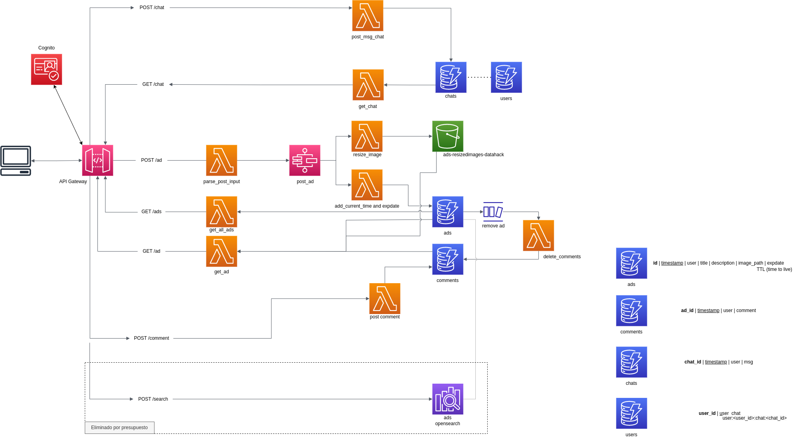

# Walla-puff (se pronuncia suspirando, como con sufrimiento)

## Despliegue de la solución

## Requisitos previos
- Acceso a una cuenta de AWS.
- Rol que permita la creación de recursos para CloudFormation.
    - Lambda
    - S3
    - DynamoDB
    - Step Functions
    - Api Gateway
    - IAM
- Crear un Bucket s3 donde almacenar los zip del directorio `deployments`.
    - Estos zip contienen el código de las lambda que desplegaremos en la aplicación

## Despliegue

### Desde consola web de AWS

Para desplegar la aplicación desde la consola, el primer paso es acceder al servicio de CloudFormation:
1. Desde el servicio de CloudFormation tenemos que crear una nueva pila.
2. Cargamos una nueva plantilla y escogemos la plantilla que se llama `cloudformation.yaml`, en la raiz de este proyecto.
3. Escribimos un nombre para el despliegue.
4. Tenemos dos parámetros para completar:
    - `DeploymentsBucket`: es el bucket donde se encuentran los archivos *.zip* del directorio `/deployments`
    - `ImagesBucket`: es el nombre del bucket donde se van a almacenar las imágenes reescaladas de los anuncios
5. De forma opcional se pueden agregar etiquetas al despliegue.
6. Se selecciona el rol con los permisos de creación de los recursos especificados en los requisitos previos.
7. La pila comienza a generarse tras revisar y enviar la configuración del despliegue.

### Desde consola con el cliente de AWS

Como requisito previo para desplegar con el cliente de AWS es necesario instalar awscli y configurarlo con credenciales de acceso.

El comando para desplegar es el siguiente:

```
aws cloudformation deploy --template-file cloudformation.yaml --stack-name ads-deployment --capabilities CAPABILITY_IAM [--parameter-overrides ImagesBucket=<bucket name> DeploymentsBucket=<bucket name>]
```

## Extra

En la documentación de este proyecto hay una colección de Postman sobre la que he estado realizando las pruebas de la API.

## Arquitectura

