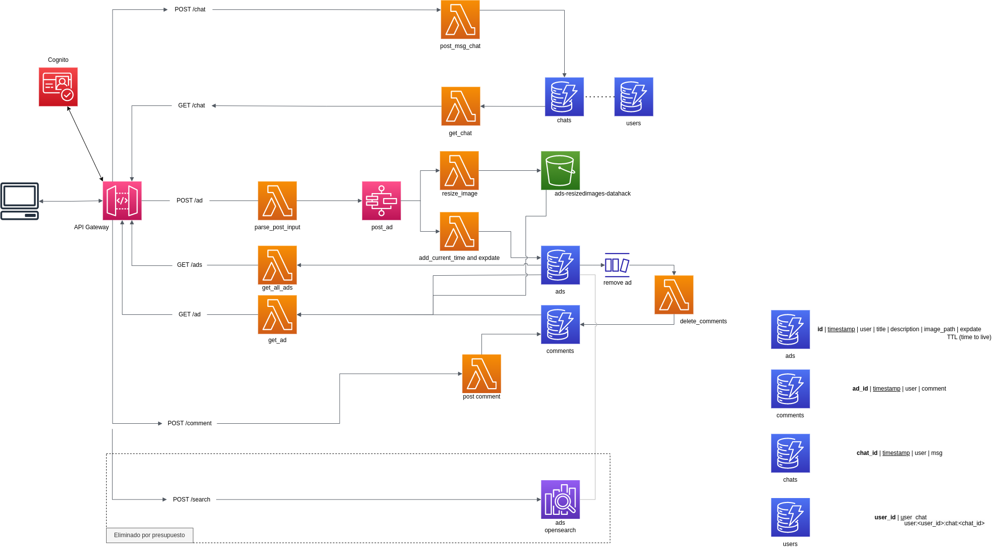

# Decisiones de diseño

## Diagrama de la arquitectura



## Explicación de la arquitectura

### Almacenamiento

#### Anuncios

Los anuncios y los comentarios se almacenan en una tabla de DynamoDB.

Los anuncios tienen un identificador como partition key (timestamp_userid), el timestamp en el que se subió como sort key, un título, descripción, path a la imagen (si tiene imagen) y una fecha de caducidad.

Los comentarios tienen un identificador del anuncio al que pertenecen como partition key, el timestamp de creación como sort key, el usuario que posteó y el comentario.

La imágenes reescaladas se almacenan en un bucket de s3.

Los anuncios tienen configurado el Time To Live para que se eliminen automáticamente al transcurrir 5 días. Cuando se elimina un anuncio (con el TTL o de forma manual), por el evento que genera automáticamente Dynamo, se dispara una Lambda que se encarga de eliminar los comentarios relacionados con el anuncio eliminado.

#### Chats

Los chats se componen de dos tablas de DynamoDB: chats y users.

La tabla de chats almacena las conversaciones entre los usuarios. Tiene un identificador del chat como partition key, un timestamp de la creación del mensaje, el usuario que lo ha puesto y el mensaje.

La tabla users es en realidad un índice para identificar el chat entre dos usuarios. Almacena el identificador de usuario como PK y como sort key almacena una cadena de la forma user:<id del usuario>:chat:<id del chat>. De forma que un chat entre paco y pepito se almacenaría dos veces en estas tablas como:

```
CHATS
__________________________________________________________
| 123467123467_paco | 123467123500 | pepito | hola paco   |
| 123467123467_paco | 123467123467 | paco   | hola pepito |
```

```
USERS
______________________________________________
| paco   | user:pepito:chat:123467123467_paco |
| pepito | user:paco:chat:123467123467_paco   |
```

### POST /ad
```
body:
    user: usuario que sube el anuncio
    title: título del anuncio
    description: descripción del objeto que se vende
    price: precio del objeto que se vende
    image: imagen del objeto en base 64
```

Cuando se postea un nuevo anuncio en la aplicación se dispara una lambda que parsea la petición y dispara una máquina de estados.

La máquina de estados está compuesta de dos funciones lambda y una inserción a dynamo:
- La primera lambda calcula el timestamp actual, en tiempo UNIX, y el expdate, que es el timestamp más cinco días y es la fecha en la que caducará el anuncio. 
- La segunda lambda se encarga de reescalar la imagen (recibida en base64), definir el path del bucket en el que se va a subir, subir la imagen, y devolver la información (que es basicamente la misma información recibida, eliminando la imagen y añadiendo el path a la imagen en el bucket).
- El resto de información se inserta en la tabla de anuncios.


### GET /ads

Este método solo dispara una lambda que realiza un scan de los anuncios, los parsea y los devuelve. Sin imágenes ni comentarios, solo los anuncios.

### GET /ad/{ad_id}

Dado un identificador de un anuncio, este método dispara una lambda que se encarga de buscar el anuncio en la tabla de anuncios, de recoger la imagen reescalada del bucket (si existe) y los comentarios del anuncio de la tabla de comentarios.

### POST /comment
```
body:
    ad_id: identificador del anuncio al que asociar el comentario
    user: usuario que sube el comentario
    comment: contenido del comentario
```

Este método dispara una lambda para parsear el contenido de la petición y subir el comentario asociado al anuncio.

### POST /chat
```
body:
  user_id: usuario que envia el mensaje
  to: usuario que recibe el mensaje,
  msg: el mensaje que se envia al usuario
```

Con este método podemos enviar un mensaje nuevo a un chat ya existente o a un nuevo chat. Dispara una lambda que parsea el mensaje y lo almacena en la base de datos. También con esta lambda se calcula una nueva entrada en el índice users para encontrar el chat entre los dos usuarios.

### GET /chat
```
query: user=<id del usuario>&to=<id del segundo usario del chat>
```

Dispara una lambda que busca el chat en el índice de usuarios con los identificadores de los dos usuarios y devuelve todos los mensajes que se han enviado.

## Decisiones

En la parte de almacenamiento he decidido utilizar DynamoDB. Sin unos requisitos más elaborados sobre el número de usuarios o las necesidades de la aplicación dudaba sobre si utilizar una base de datos relacional o una base de datos noSQL. Por los requisitos de `Coste cero (menor de 0.01€/mes) en reposo (desplegado pero sin actividad)` y `Minimizar el soporte requerido para la operación de la solución`, me he decidido por DynamoDB antes que RDS. En reposo el coste de esta DB es 0.

Probablemente en una aplicación realista con las mismas características, pero con un volumen elevado de usuarios (como por ejemplo Wallapop) seguiría utilizando una base de datos no relacional como Dynamo por su bajo coste, principalmente.

Para el procesamiento de las peticiones he utilizado funciones lambda por su capacidad completamente serverless. Otra opción hubiese sido utilizar servicios como ECS o EC2, pero no son Serverless y su mantenimiento hubiese sido mucho más caro.

Para la parte del chat hubiese utilizado una API Websocket, que permite mantener conexiones abiertas. Esta característica hace que sea más racional utilizarla para el requisito de los chats, pero por falta de conocimiento sobre la herramienta y tiempo, he implementado esta funcionalidad en una API Rest.