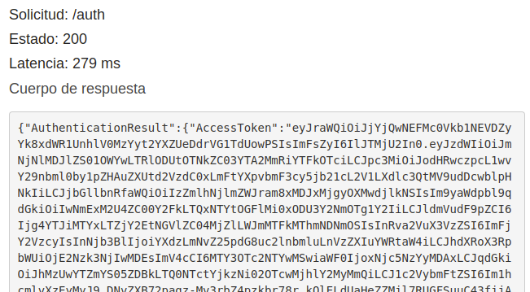

# Control de acceso de usuarios

Aunque en este proyecto no haya entregado documentación relacionada con este apartado, sí que lo he implementado.

Lo que he hecho para implementar ha sido utilizar el servicio de Cognito. He creado una User Pool de cognito con valores por defecto, excepto para el cliente de aplicación pues le he añadido la opción de autenticación con nombre de usuario y contraseña: ALLOW_USER_PASSWORD_AUTH.

En la api he creado un nuevo recurso `/auth` con un método POST. Con este método se puede autenticar un usuario con usuario y contraseña.


Y devuelve una serie de tokens que se usan para autenticar. Concretamente el IdentityToken. Esta es la respuesta del método `auth`:



Para integrar la API con el user pool he creado, en el servicio de API Gateway, en mi api, un nuevo autorizador:


Finalmente, en el método de añadir nuevos anuncios, `POST /ad` he añadido como autenticador el previamente creado:


De este modo, si hacemos una petición sin el Header de Authorization, el método nos devuelve un error de autorización:


Pero si hacemos una petición correcta, seteando la autorización con el token de cognito, podemos postear el anuncio:


## Notas extra

No he implementado esto en la práctica final porque no he sido capaz de configurar Cognito en cloudformation, pero he dejado una api de prueba con esta funcionalidad por si se quiere probar: https://mar4zgws13.execute-api.eu-west-1.amazonaws.com/prod

El método es `POST /auth` con:

```
{
  "AuthFlow": "USER_PASSWORD_AUTH",
  "ClientId": "3fia69febkjo102q2829s0v9d5",
  "AuthParameters": {
    "USERNAME": "mario_123",
    "PASSWORD": "Ultra.Password456"
  }
}
```

De la respuesta hay que coger el `IdToken` y ponerlo en el Header `Authorization` de la petición `POST /ad`.

# OpenSearch "Serverless"

Como se puede ver en la arquitectura, hay una parte de búsqueda implementada con OpenSearch serverless. He mantenido el código en el directorio `optional_search/`.

Lo que implementé fue una réplica de la base de datos de anuncios en OpenSearch, aunque solo almacenando los títulos de los anuncios y las descripciones, pues es sobre los campos que más comúnmente se podrían hacer búsquedas. Cada vez que se sube un anuncio se creaba un documento en OpenSearch con la información del mismo. Elegí esta opción por las capacidades de búsqueda que da OpenSearch.

Para buscar, simplemente se realizaba una query sobre los campos de los anuncios de OpenSearch.

Cuando se eliminaba un anuncio también se eliminaba su par en OpenSearch.

No he subido esta parte de la práctica porque OpenSearch Serverless tiene un coste de mantenimiento constante que escala a un mínimo de 700$ mensuales (por suerte yo sólo he perdido 45$).

# Interfaz web

Mi idea para completar este requisito era alojar una web estática en s3 y que pudiese hacer consultas directamente a la API con un script de JS.

De este requisito sólo voy a decir que me alegra no haberme dedicado profesionalmente al desarrollo web.